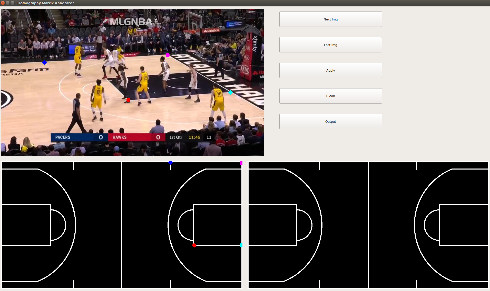
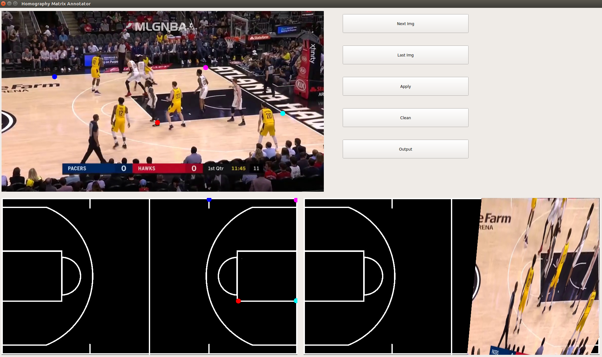

# Homography Annotator

This repo holds the code of a simple homography annotator for sports field registration.


## Dependencies

* Python == 3.6
* PyQt5
* OpenCV

## Usage procedure

1. Users can put images into the dataset/img directory and run the script:
```
python homography_annotator.py
```

2. Users need to click the image with the mouse to determine the 4 corresponding point-pairs (8 points), including 4 points in the broadcast image and another 4 points in the template image. Different point-pair has different colors, as shown in the following figure:


3. After confirming 4 corresponding point-pairs, users can click the "Apply" button to show the visual result of homography annotation, as shown in the following figure:


4. Users can click the "Clean" to clean the current result or click the "Output" to write the current homography matrix file into the dataset/H_mat directory. The "Next Img" and "Last Img" button can be used to select the image. 
